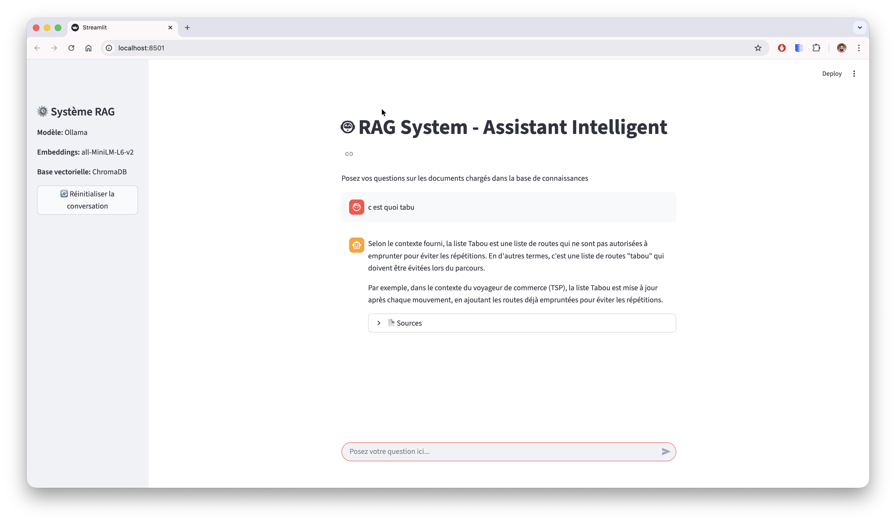
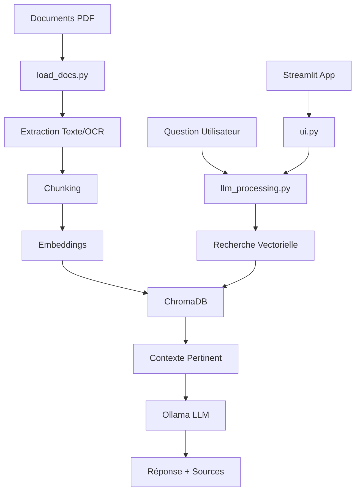

# 🤖 Système RAG - Assistant Intelligent

Un système de Retrieval-Augmented Generation (RAG) complet utilisant ChromaDB, Ollama et Streamlit pour créer un assistant intelligent capable de répondre aux questions basées sur vos documents PDF.

## 📋 Interface

## ✨ Caractéristiques

### 🔍 **Traitement intelligent des documents**
- Extraction de texte avancée depuis PDF (texte + OCR)
- Support multilingue (français/anglais) avec Tesseract
- Chunking intelligent des documents
- Embeddings avec SentenceTransformers

### 🧠 **IA conversationnelle**
- Intégration avec Ollama (modèles LLM locaux)
- Prompts personnalisés en français
- Recherche par similarité vectorielle
- Réponses avec sources citées

### 🌐 **Interfaces multiples**
- Interface web Streamlit moderne et intuitive
- Mode CLI interactif pour les développeurs
- API REST (extensible)
- Support Docker pour déploiement facile

### 💾 **Stockage et performance**
- Base vectorielle ChromaDB persistante
- Cache des embeddings pour performance
- Health checks et monitoring
- Volumes Docker pour persistance des données

## 🏗️ Architecture

### Version actuelle
- ✅ Support PDF avec OCR multilingue
- ✅ Interface Streamlit complète
- ✅ Intégration Ollama
- ✅ Déploiement Docker

